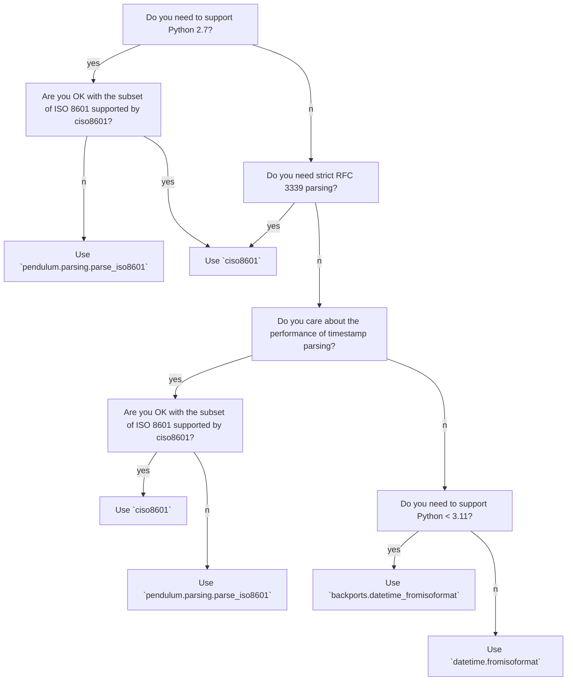

# Should I use ciso8601? <!-- omit in toc -->

`ciso8601`'s goal is to be the world's fastest ISO 8601 datetime parser for Python.
However, `ciso8601` is not the right choice for all use cases.
This document aims to describe some considerations to make when choosing a timestamp parsing library.

- [Do you care about the performance of timestamp parsing?](#do-you-care-about-the-performance-of-timestamp-parsing)
- [Do you need strict RFC 3339 parsing?](#do-you-need-strict-rfc-3339-parsing)
- [Are you OK with the subset of ISO 8601 supported by ciso8601?](#are-you-ok-with-the-subset-of-iso-8601-supported-by-ciso8601)
- [Do you need to support Python \< 3.11?](#do-you-need-to-support-python--311)
- [Do you need to support Python 2.7?](#do-you-need-to-support-python-27)

### Flowchart <!-- omit in toc -->



## Do you care about the performance of timestamp parsing?

In most Python programs, performance is not a primary concern.
Even for performance-sensitive programs, timestamp parsing performance is often a negligible portion of the time spent, and not a performance bottleneck.

**Note:** Since Python 3.11+, the performance of cPython's `datetime.fromisoformat` is now very good. See [the benchmarks](https://github.com/closeio/ciso8601#benchmark).

If you really, truly want to use the fastest parser, then `ciso8601` aims to be the fastest. See [the benchmarks](https://github.com/closeio/ciso8601#benchmark) to see how it compares to other options.

## Do you need strict RFC 3339 parsing?

RFC 3339 can be (roughly) thought of as a subset of ISO 8601. If you need strict timestamp parsing that will complain if the given timestamp isn't strictly RFC 3339 compliant, then [`ciso8601` has a `parse_rfc3339` method](https://github.com/closeio/ciso8601#strict-rfc-3339-parsing).

## Are you OK with the subset of ISO 8601 supported by ciso8601?

You probably are. `ciso8601` [supports the most commonly seen subset of ISO 8601 timestamps](https://github.com/closeio/ciso8601#supported-subset-of-iso-8601).

If not, consider [`pendulum`](https://github.com/sdispater/pendulum)'s `parsing.parse_iso8601` instead:

```python
from pendulum.parsing import parse_iso8601
parse_iso8601(timestamp)
```

## Do you need to support Python < 3.11?

Since Python 3.11, `datetime.fromisoformat` supports parsing nearly any ISO 8601 timestamp, and the cPython implementation is [very performant](https://github.com/closeio/ciso8601#benchmark).

If you need to support older versions of Python 3, consider [`backports.datetime_fromisoformat`](https://github.com/movermeyer/backports.datetime_fromisoformat).

## Do you need to support Python 2.7?

`ciso8601` still supports Python 2.7, and is [much faster](https://github.com/closeio/ciso8601#benchmark) than other options for this [deprecated version of Python](https://pythonclock.org/).
